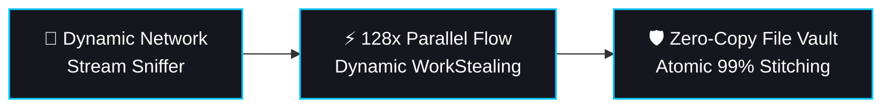

# ⚡ Nyxor Download Manager

### High-Throughput Network Engine & Low-Latency Media Ingestion Platform

  <a href="#-overview"><b>Overview</b></a> •
  <a href="#-why-nyxor-comparison"><b>Why Nyxor?</b></a> •
  <a href="#-key-features"><b>Key Features</b></a> •
  <a href="#-screenshots"><b>Screenshots</b></a> •
  <a href="#-quick-start"><b>Quick Start</b></a> •
  <a href="#-browser-integration"><b>Browser Extension</b></a> •
  <a href="#-community--support"><b>Community</b></a>

---

## 📌 Overview

**Nyxor Download Manager (NDM)** is an enterprise-grade desktop accelerator built from the ground up for maximum bandwidth saturation and seamless media archiving on Windows x64. Powered by a hybrid high-concurrency architecture, Nyxor replaces standard single-stream downloading with real-time dynamic segment slicing, automated socket recovery, zero-copy memory allocation, and native transport stream compilation.

Designed for creators, software engineers, and power users demanding uncompromising transfer speeds, continuous 24/7 reliability, and zero byte corruption.

---

## 📊 Why Nyxor? (Comparison)

| Capability / Benchmark | Nyxor Download Manager | Conventional Accelerators | Standard Web Browsers |
| :--- | :---: | :---: | :---: |
| **Max Concurrent Slices** | **Up to 128+ Streams** | 8 – 32 Streams | 1 Single Stream |
| **Data Integrity Engine** | **Atomic Write Verification (Zero 99% Freeze)** | ⚠️ Prone to Assembly Errors | ❌ Basic Resumption |
| **Live Stream Capture (DVR)** | **Native HLS / DASH / MP4 Muxer** | ❌ Requires Third-Party CLI | ❌ Not Supported |
| **Disk Space Allocation** | **Zero-Copy Sparse Pre-Allocation** | Traditional File Filling | Standard On-The-Fly |
| **User Interface** | **Double-Buffered Custom GDI+ Fluent-Dark** | Legacy WinForms / Win32 | Standard Web Rendering |
| **Telemetry & Privacy** | **100% Local Machine Isolation (`127.0.0.1`)** | Varies / Analytics Tracking | Cloud-Synced Telemetry |

---

## ⚡ Key Features

### 🚀 Ultra-Speed Multi-Segment Engine
* **Dynamic Range Slicing:** Dynamically fragments incoming transfers into up to **128 parallel streams**, completely bypassing ISP and server-side single-thread throttles.
* **Intelligent Work Stealing:** Actively redistributes pending byte-ranges from stalled or lagging connections to high-speed idle sockets in real time.
* **Zero 99% Assembly Corruption:** Advanced atomic write pipelines eliminate file corruption during final stitching, guaranteeing 100% byte verification.
* **Zero-Copy Disk Allocation:** Instantly reserves contiguous file blocks upon link ingestion, preventing disk fragmentation and system lockups on multi-gigabyte payloads.
* **Atomic Session Recovery:** Instant resumption saves state and resumes tasks without zero-byte loss after power failures, crashes, or connection drops.

### 🎥 Live Stream DVR & Media Extraction
* **Universal Live Capture:** Real-time stream recording for **HLS (`.m3u8`)**, **DASH (`.mpd`)**, and **FLV** live broadcasts across major video platforms.
* **Ad-Free Recording:** Node-filtering algorithms automatically detect and skip advertisement fragments during real-time ingest.
* **Lossless Remux Pipeline:** Packages raw adaptive streams directly into standard **MP4/MKV** containers without quality degradation or re-encoding penalties.
* **Ultra HD Formats (4K / 8K):** Seamlessly extracts and stitches detached adaptive video and high-bitrate audio tracks (up to **8K 60fps** and **320kbps audio**).
* **Auto-Healing Links:** Automatically captures refreshed authorization tokens and resumes expired downloads without user intervention.

### 🗂️ Task Management & Smart Organization
* **Smart Confirm Deletion Dialog:** Granular deletion control:
  * **Remove from list only:** Clears workspace history while leaving physical downloads intact.
  * **Delete from list and disk permanently:** Purges physical files and cleans all associated temporary (`.part`) allocation chunks to reclaim storage instantly.
  * **Persistent Choice:** Save decisions to bypass prompts in subsequent operations.
* **Automatic Categorization:** Automatically organizes and routes completed files into dedicated category directories (*Compressed, Documents, Music, Programs, Video*).
* **Recursive Site Grabber:** High-speed crawler maps XML sitemaps and batch-archives media galleries or remote document trees.

### 🛡️ Network Tunneling & Proxy Engine
* **Universal Protocols:** Full support for **HTTP, HTTPS, SOCKS4, and SOCKS5** proxies with custom authentication.
* **Integrated Latency Diagnostic:** Real-time ping, DNS resolution check, and node health tester inside the configuration panel.
* **WAF & Rate-Limit Evasion:** Tailored browser user-agent rotation and TLS keep-alive handling prevent aggressive bot throttles.

### 🎨 Pure GDI+ Fluent-Dark Interface
* **Zero Default Controls:** Built with custom double-buffered GDI+ rendering, featuring sub-pixel anti-aliasing and a rigorous 8/16px alignment grid.
* **Persistent High-DPI Icon Vault:** Native high-resolution icon extraction (48px / Jumbo) provides crystal-clear fidelity without reverting to generic icons on restart.
* **Redesigned Notification Center:** Modern glassmorphism alert cards with smooth spring physics and dismiss transitions.
* **Integrated Checksum Verifier:** Built-in cryptographic hash verification supporting **MD5**, **SHA-1**, and **SHA-256** checksums.

---

## 📸 Screenshots

### 1. Main Workspace & Completion Center
*Custom double-buffered GDI+ workspace with live category sorting and high-fidelity completion dialog.*
 

  

### 2. Multi-Segment Live Monitor & Speed Limiter
*Real-time socket inspection, adaptive bandwidth saturation, and granular chunk progress tracking.*
 

  

### 3. Advanced Media Grabber & Stream Ingestion
*Deep media parser supporting direct 4K UHD (60fps), 2K Quad HD, and high-bitrate adaptive DASH streams.*
 

  

### 4. Modern Fluent Notification Toast
*Minimalist desktop alert cards featuring clean typography, status glows, and smooth dismiss animations.*
 

---

## 🧩 Browser Integration

Nyxor pairs seamlessly with an official browser companion extension for **Microsoft Edge** and **Google Chrome**:

* **Fluid HUD Capsule:** Interactive floating overlay with smooth pop/hover transitions and microscopic optical alignment.
* **Inline Media Dismiss (`| ✕`):** Dismiss download prompts for specific media targets with an interactive 90° rotation animation and spatial suppression.
* **Reactive Offline Awareness:** The capsule dynamically transitions to a glowing crimson state when Nyxor is closed, providing instant connectivity feedback.
* **Pre-Download Caching:** Gathers file metadata the moment you interact with a link for immediate handoff.
* **Local Isolation:** Operates strictly on your local machine (`127.0.0.1`) with zero external network traffic or browsing telemetry.

> [!TIP]
> Open **Settings (<kbd>⚙️</kbd>) -> Add-ons** inside Nyxor to install the companion extension directly into your browser.

---

## 🚀 Quick Start

### System Requirements
* **Operating System:** Windows 10 / Windows 11 (64-bit strictly required)
* **Runtime:** .NET Framework 4.8 or higher
* **Storage:** Solid-State Drive (SSD) recommended for high-concurrency 128-stream assembly

### Getting Started
1. Grab the latest package from the **[Releases](https://github.com/UacoderSYS/Nyxor-Download-Manager/releases)** section.
2. Extract or run `NyxorDM.exe`.
3. Launch the application and click **"Start Free Trial"** to initialize your local high-concurrency session.
4. Configure your preferred download directory in **Settings** (<kbd>⚙️</kbd>).

<b>⌨️ Keyboard Shortcuts Reference</b>

| Shortcut | Action |
| :--- | :--- |
| <kbd>Ctrl</kbd> + <kbd>N</kbd> | Add New Download URL |
| <kbd>Ctrl</kbd> + <kbd>B</kbd> | Batch Add Downloads |
| <kbd>Space</kbd> | Pause / Resume Selected Download |
| <kbd>Delete</kbd> | Trigger Smart Deletion Prompt |
| <kbd>Ctrl</kbd> + <kbd>A</kbd> | Select All Tasks |
| <kbd>Ctrl</kbd> + <kbd>,</kbd> | Open Preferences Hub |

---

## 🧩 Optional Plugins & Auxiliary Tools

While **Nyxor Download Manager** relies entirely on its **proprietary native engine (.NET & Rust Core)** for all network streaming, multi-segmented TCP routing (up to 128+ threads), zero-copy kernel disk commits, and direct downloads, it delegates certain dynamic web scraping tasks to auxiliary tools:

* **[yt-dlp](https://github.com/yt-dlp/yt-dlp):** Integrated solely as an optional upstream resolver plugin for parsing dynamic tokens and manifest URLs from social media platforms. *(The actual multi-part network ingestion and chunk assembling remain 100% handled by Nyxor's internal engine).*
* **[FFmpeg](https://ffmpeg.org/):** Utilized strictly as a secondary post-muxing utility when compiling detached adaptive audio/video DASH streams.

*Nyxor is an independent standalone download executive and is not affiliated with or a simple GUI wrapper for these third-party utilities.*

---

## 💬 Community & Support

Need assistance, want to report an issue, or suggest a new feature? Connect through our official channels:

* 🌐 **Official Website:** [nyxorlabs.com](https://nyxorlabs.com)
* 📢 **Telegram Community:** [Nyxor Global](https://t.me/nyxorglobal)
* 📧 **Direct Inquiry:** [nyxorlabs@gmail.com](mailto:nyxorlabs@gmail.com)

---

  Architected and engineered by <b>Uacoder</b> • Copyright © 2026 <b>Nyxor Labs</b>. All rights reserved.

